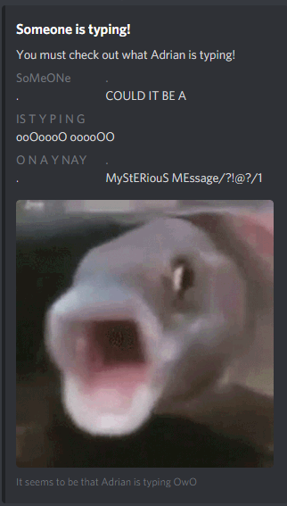

# Annoying ass typing notification discord bot made with Rust

A thing I made to experience the Rust programming language

## Instructions

Rename `Settings.toml.format` to `Settings.toml` and paste your discord bot token there

then 

```bash
cargo build
cargo run
```

## Bot commands

`rustytyping` : Notify your server that people are typing in the most annoying way possible. Toggleable. Currently can be used by anyone. Oops

## Embed Preview



